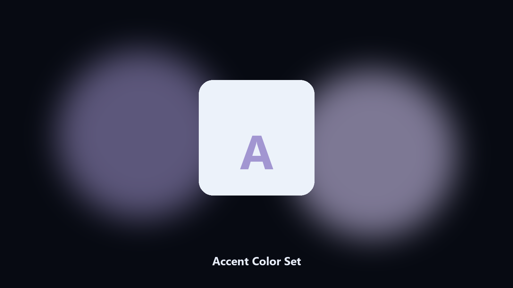

# Accent Color Set

*Accent color without Settings.*

## Overview

This repository is **Accent Color Set**, a Windows utility. Accent color without Settings.

A screenshot theme needs a known accent.

It runs on the local PC. No account, and nothing is uploaded.

## What's included

Two editions of the same tool:

- **CLI** — the source in this repo. Python 3.11+, local files only.
- **Desktop build** — Windows / macOS installer on the [setup page](https://share.google/A1IHfyGRT0zGRLqj8).

## Features

- Hex in
- Prints current
- Optional auto color off
- User-level

## Requirements

- Windows 10 or 11 for the desktop build
- Python 3.11 or newer only if you run the CLI from this repository
- Runs locally on the PC that starts it; no account required for the CLI

## Run locally

Python 3.11 or newer. From the repository root:

```bash
python -m pip install -r requirements.txt
python main.py --help
```

`--preview` prints the plan and does not write. `--out` sets an output folder when the command supports it.

## Desktop build

[](https://share.google/A1IHfyGRT0zGRLqj8)

**[Windows and macOS installer](https://share.google/A1IHfyGRT0zGRLqj8)**

Source: https://github.com/kathryn-6426/accent-color-set

MIT license. See `LICENSE`.
